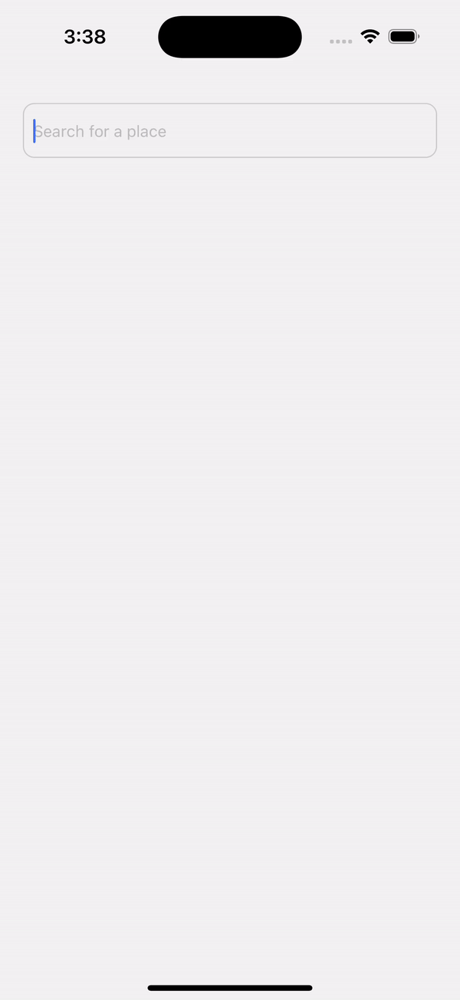

# React-native-google-place-search

`react-native-google-place-search` is a React Native component that allows you to easily implement a Google Places autocomplete search feature in your application. It provides a customizable UI to search for places and get details like coordinates.

## Preview



## Features

- **Google Places Autocomplete**: Autocomplete suggestions as you type.
- **Customizable UI**: Customize input styles, list items, headers, and footers.
- **Powered By Google Logo**: Optionally display the "Powered by Google" logo.
- **Place Details Fetching**: Fetch detailed place information including latitude and longitude.
- **Debounce Search**: Optimized search requests using a debounce function.
- **Error Handling**: Display errors if API key is missing or when an API call fails.

## Installation

```bash
npm install react-native-google-place-search
```

or

```bash
yarn add react-native-google-place-search
```

## How to Use

Here’s an example of how to use the `GooglePlaceSearch` component in your project:

```jsx
import React from "react";
import { View, Text } from "react-native";
import GooglePlaceSearch from "react-native-google-place-search";

const App = () => {
  const handlePlaceSelected = (place) => {
    console.log("Selected Place:", place);
  };

  return (
    <View style={{ flex: 1 }}>
      <GooglePlaceSearch
        onPlaceSelected={handlePlaceSelected}
        apiKey="YOUR_GOOGLE_API_KEY"
        placeholder="Search for a location"
      />
    </View>
  );
};

export default App;
```

### Props

Below are all the props that the `GooglePlaceSearch` component accepts:

| Prop Name               | Type                                             | Default                  | Description                                                                |
| ----------------------- | ------------------------------------------------ | ------------------------ | -------------------------------------------------------------------------- |
| `onPlaceSelected`       | `(place: Place & Partial<PlaceDetails>) => void` | **Required**             | Callback fired when a place is selected from the list.                     |
| `apiKey`                | `string`                                         | **Required**             | Your Google Places API key.                                                |
| `placeholder`           | `string`                                         | `"Search for a place"`   | Placeholder text for the search input.                                     |
| `shouldShowPoweredLogo` | `boolean`                                        | `true`                   | Whether to display the "Powered by Google" logo at the bottom of the list. |
| `containerStyle`        | `StyleProp<ViewStyle>`                           | `undefined`              | Style for the container view.                                              |
| `inputStyle`            | `StyleProp<TextStyle>`                           | `undefined`              | Style for the text input.                                                  |
| `placeItemStyle`        | `StyleProp<ViewStyle>`                           | `undefined`              | Style for each place item in the list.                                     |
| `placeTextStyle`        | `StyleProp<TextStyle>`                           | `undefined`              | Style for the place text in each list item.                                |
| `listFooterComponent`   | `React.ReactNode`                                | `Powered by Google` logo | Footer component for the list (e.g., a custom logo or loading indicator).  |
| `listFooterStyle`       | `StyleProp<ViewStyle>`                           | `undefined`              | Style for the footer component.                                            |
| `listHeaderComponent`   | `React.ReactNode`                                | `undefined`              | Header component for the list.                                             |
| `listHeaderStyle`       | `StyleProp<ViewStyle>`                           | `undefined`              | Style for the header component.                                            |
| `minimumQueryLength`    | `number`                                         | `3`                      | Minimum number of characters required to trigger the search.               |

### Place Object Structure

The `onPlaceSelected` callback provides a place object with the following structure:

```js
{
  description: string,  // The description of the place
  place_id: string,     // The unique place ID
  lat?: number,         // (Optional) Latitude of the place
  lng?: number          // (Optional) Longitude of the place
}
```

### Example Usage

```jsx
<GooglePlaceSearch
  onPlaceSelected={(place) => console.log("Selected place:", place)}
  apiKey="YOUR_GOOGLE_API_KEY"
  placeholder="Enter location"
  shouldShowPoweredLogo={false}
  containerStyle={{ margin: 16 }}
  inputStyle={{ borderColor: "blue", borderWidth: 1 }}
  placeItemStyle={{
    padding: 10,
    borderBottomColor: "#ccc",
    borderBottomWidth: 1,
  }}
  placeTextStyle={{ color: "black", fontSize: 16 }}
  minimumQueryLength={2}
/>
```

### License

This project is licensed under the MIT License. See the [LICENSE](LICENSE) file for details.
